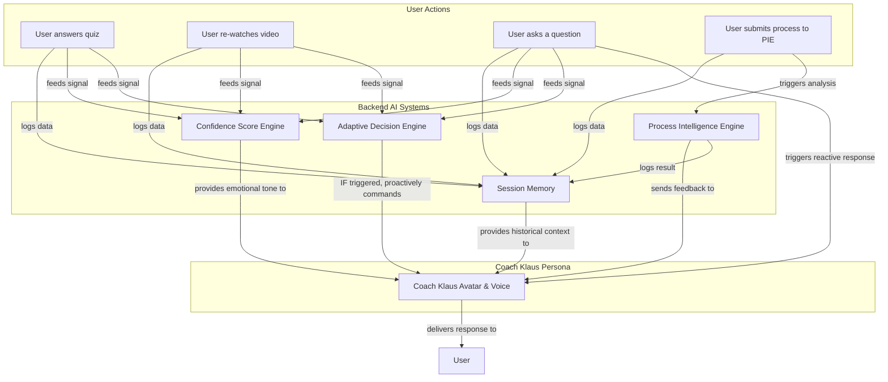

# Consolidated AI Requirements for The Forge Platform
**Version:** 1.0
**Date:** October 15, 2025
**Author:** Jules (Synthesized from Project Documentation)

---

## 1. Executive Summary

This document serves as the single, definitive source of truth for the AI functionality within The Forge platform. It has been synthesized from multiple project documents to resolve contradictions and provide a clear, unified vision for development. The core of the platform is **Coach Klaus**, an AI mentor powered by five interconnected systems designed to create a proactive, personalized, and emotionally intelligent learning experience.

The primary point of clarification is the function of the **Adaptive Decision Engine (ADE)**. Based on the client's explicit vision and details found in the `Final Requirements, Timelines, and Cost` document, the ADE is defined here as a **proactive system** that intelligently recommends content based on user performance, not merely a reactive system that changes tone.

---

## 2. The Five Core AI Systems

### 2.1. Session Memory
The Session Memory is the AI's long-term memory, enabling it to recall past interactions and personalize its coaching over time.

*   **Initial Seeding:** The memory for each user/team is initially populated with the quantitative scores and qualitative, free-text notes from the human coach's physical **"Tactic Check."**
*   **Data Stored:** It continuously aggregates:
    *   Quiz scores and performance on interactive elements.
    *   Content consumption patterns (e.g., videos re-watched).
    *   Questions asked to Coach Klaus.
    *   Qualitative analysis and feedback from the Process Intelligence Engine (PIE).
    *   Historical Confidence Score trends.
*   **Data Isolation:** Session Memory is strictly isolated per user/company. There is no cross-contamination of knowledge or data between clients.

### 2.2. Process Intelligence Engine (PIE)
The PIE is the mechanism for bridging theoretical knowledge with real-world application.

*   **Purpose:** To analyze a user's real-world processes and provide qualitative, actionable feedback.
*   **Activation:** Occurs during the "Transfer Application" phase of a "Match Day" (from Match Day 5 onwards). Coach Klaus will proactively prompt the user to describe a relevant process.
*   **User Input:** The user can submit their process via:
    *   Text input
    *   Voice-to-text
    *   Document upload (e.g., PDF)
*   **AI Analysis:** The AI model analyzes the input to identify weaknesses, such as media discontinuities, lack of automation, or logical gaps, based on the principles taught in the learning modules.
*   **Output:** Coach Klaus delivers the feedback conversationally. The analysis is **not scored or graded**, but the results and recommendations are saved to the Session Memory.

### 2.3. Confidence Score
The Confidence Score is the AI's "emotional sensor." Its sole purpose is to modulate the **tonality and empathy** of Coach Klaus's responses.

*   **Inputs:** The score is calculated in the background based on a combination of signals:
    *   **Performance:** Number of incorrect answers in quizzes.
    *   **Behavior:** Number of times a user re-watches a video or repeats a module.
    *   **Pacing:** Time taken to complete quizzes or respond to prompts.
    *   **Language:** Frequency of help requests and the presence of negative sentiment keywords (e.g., "I don't understand," "this is hard").
*   **Output:** A lower score will cause Coach Klaus's language to become more supportive, patient, and encouraging. A higher score will result in a more direct, performance-driven tone.
*   **Critical Clarification:** The Confidence Score itself **does not** trigger proactive interventions. It only affects the *style* of the AI's next reactive response. The triggering of proactive help is the responsibility of the Adaptive Decision Engine (ADE).

### 2.4. Adaptive Decision Engine (ADE)
The ADE is the proactive intelligence of the platform. It is responsible for identifying when a user is struggling and intelligently intervening with supplemental learning content.

*   **Purpose:** To prevent users from getting stuck and to reinforce learning by providing timely, targeted support.
*   **Triggering Events (Learning Friction):** The ADE monitors the user's activity for patterns that indicate difficulty, such as:
    *   Repeated failures on a specific quiz question or concept.
    *   Excessive time spent on a single learning task.
    *   Multiple help requests to Coach Klaus about the same topic.
*   **Action:** When the ADE detects significant learning friction, it will **proactively recommend a "micro-learning" module**.
    *   This recommendation is delivered by Coach Klaus (e.g., "I noticed you're struggling with this concept. I've found a simpler explanation from another module that might help. Would you like to review it?").
    *   The recommended content can be from **anywhere in the content library**, including "simpler, 'baby versions' of explanations" provided by the content creation team.
*   **Resolution of Conflict:** This definition aligns with the `Final Requirements, Timelines, and Cost` document and the client's stated vision. It supersedes the conflicting, purely reactive model described in the `Finalized User Journey` document.

### 2.5. Coach Klaus Persona & Interaction Model
Coach Klaus is the user-facing persona of the AI system.

*   **Technology:** The visual representation is a **D-ID avatar**. The underlying intelligence is powered by a self-hosted **LLaMA 3.3 model** augmented by a proprietary prompt engine (**"ErxlebenGPT"**) that controls personality and interprets the outputs of the other AI systems.
*   **Interaction Modes:**
    1.  **Proactive (Scripted):** At fixed points, like the start and end of a "Match Day," Coach Klaus delivers pre-recorded, non-interactive video messages.
    2.  **Reactive (User-Initiated):** The user can click on the Coach Klaus avatar at any time to ask a question. The AI will have full context of the user's current screen and will generate a response whose tone is dictated by the **Confidence Score**.
    3.  **Proactive (ADE-Driven):** As described in section 2.4, Coach Klaus will deliver proactive interventions when triggered by the **Adaptive Decision Engine**.
*   **Presence:** The avatar is persistently visible but non-intrusive to create a feeling of constant support.

---

## 3. System Architecture & Data Flow

This section explains how the five AI systems interconnect to create a seamless, intelligent coaching experience.

### Data Flow Explained:

1.  **All Roads Lead to Session Memory:** Every significant user action—answering a quiz, re-watching a video, asking a question, or submitting a process to the PIE—is logged in the **Session Memory**. This makes it the central repository of the user's entire history.

2.  **Real-time Analysis (Confidence & Adaptation):** At the same time, these user actions are fed as real-time signals to both the **Confidence Score Engine** and the **Adaptive Decision Engine (ADE)**.
    *   The **Confidence Score** engine uses these signals to continuously update its understanding of the user's emotional state.
    *   The **ADE** uses these signals to monitor for "learning friction."

3.  **Reactive Interaction (User Asks a Question):**
    *   The user clicks the Coach Klaus avatar.
    *   The **Coach Klaus Persona** activates and pulls the most recent **Confidence Score** to determine *how* to speak (empathetic, demanding, etc.).
    *   It also queries the **Session Memory** to understand the user's history and the context of the current screen.
    *   With this information, it generates and delivers a relevant, emotionally-attuned response.

4.  **Proactive Intervention (ADE Detects Struggle):**
    *   The **ADE** identifies a pattern of struggle from the incoming user signals (e.g., failed quiz three times).
    *   It takes command, queries the content library for a relevant "micro-learning" module, and instructs the **Coach Klaus Persona** to intervene.
    *   Coach Klaus delivers the proactive recommendation to the user.

5.  **Process Analysis (PIE):**
    *   During the "Transfer Application" phase, the user's submission is sent directly to the **Process Intelligence Engine (PIE)** for analysis.
    *   The PIE generates its qualitative feedback and passes it to the **Coach Klaus Persona** to be delivered conversationally.
    *   The result of this interaction is also logged in the **Session Memory**.