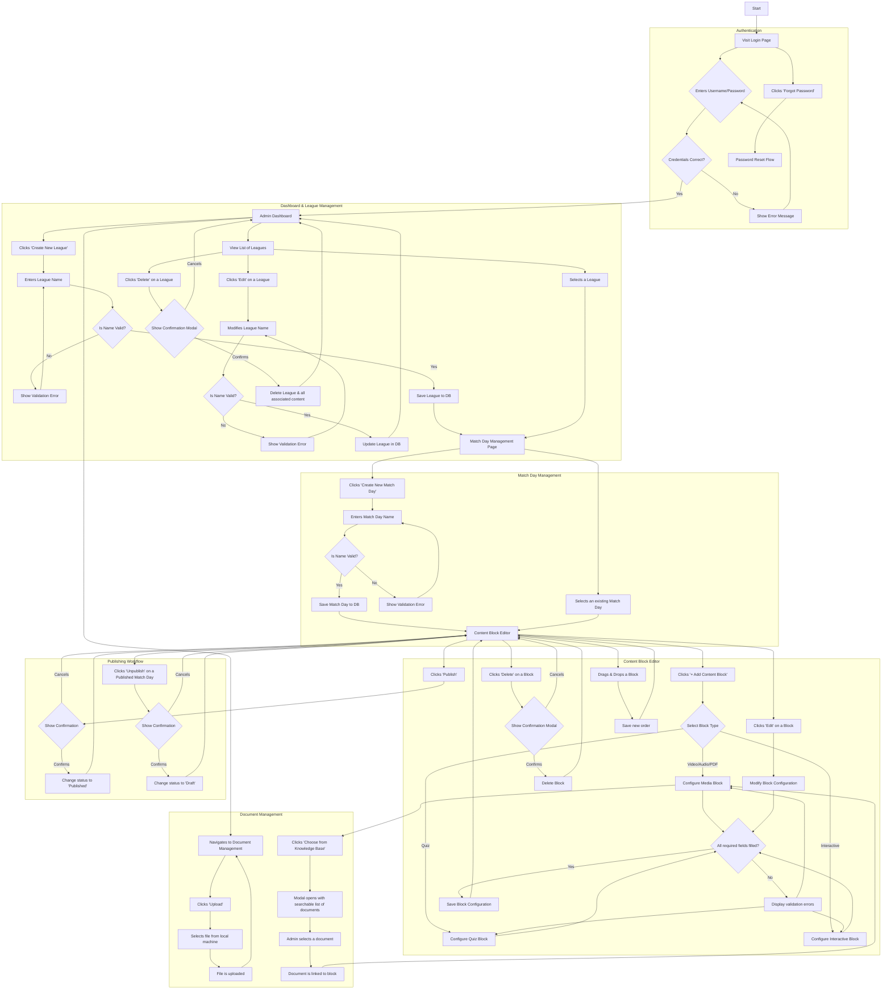

# Admin Panel and UI Documentation

Author: Muhammad Irtaza, Nouman Javaid, Bilal Khalid, Muhammad Usman Khan, Menahil Baig
Creation Date: August 15, 2025
Type: Admin Panel
Version: Final

## 1. Introduction

This document provides a detailed specification for the user interface (UI) and functionality of a content creation platform (Admin Experience) and its corresponding end-user application (Player Experience). It also outlines the scope and deliverables for the initial development milestone.

https://match-day-content-platform-2.vercel.app/

[https://match-day-content-platform-2.vercel.app/](https://match-day-content-platform-2.vercel.app/)

## 2. Admin Experience: Content Creation Platform

### 2.1. Authentication and Dashboard

**Login:**

- A secure login portal will feature fields for a username and password, along with a "Forgot Password" recovery option. Authentication will be managed using security tokens.

**Dashboard:**

- After a successful login, administrators are directed to the main dashboard, which offers a high-level overview of all created content.
- The dashboard will feature a list of all "Leagues." Each league in the list will serve as a link to its respective "League Management" page.
- A "Create New League" button will be prominently displayed for easy access.

### 2.2. League Management

- Administrators can access the League Management page by either clicking an existing league on the dashboard or selecting the "Create New League" button.
- **Creating a League:** Admins will be prompted to provide a "League Name." Once created, they are automatically navigated to the "Match Day Management" view for the new league.
- **Editing a League:** An existing league's name can be modified.
- **Deleting a League:** To prevent accidental data loss, a confirmation modal will appear before deletion. Deleting a league will permanently remove all of its associated "Match Days" and their content.

### 2.3. Match Day Management

- This interface is accessed by selecting a specific league and displays a comprehensive list of all "Match Days" it contains.
- Each match day is a clickable item that directs the admin to the "Content Block Management" editor for that lesson.
- A "Create New Match Day" button is available to add new lessons to the league.

### 2.3.1. Environment and Transition Control

- **Room Selection:** For each Match Day, an administrator can use a dropdown menu to select a "Room," which sets the background environment (e.g., Locker Room, Trainer's Office).
- **Transition Videos:** To create a more cinematic experience, admins can assign a transition video to play when moving between different rooms or content blocks. This is configured within the CTA/Trigger system.

<aside>

### 2.4. Content Block Editor

- The core of the platform is a visual, block-based editor where administrators build the content for each Match Day by adding, editing, reordering, and deleting content blocks.
- **Adding Content Blocks:** A "+" button allows admins to open a menu and select from various block types. Each block has a specific purpose and set of configuration options:
    - **`Video` Block:**
        - **Purpose:** To embed and play a video within the lesson.
        - **Configuration:** The admin provides a title for the block and selects a video file by either uploading a new one or choosing an existing one from the Document Management (Knowledge Base).
        - **User View:** The user sees a video player with standard controls (play, pause, volume, full-screen).
    - **`Audio` Block:**
        - **Purpose:** To embed and play an audio clip.
        - **Configuration:** Similar to the video block, the admin provides a title and selects an audio file from the Document Management system.
        - **User View:** The user sees an audio player with play/pause and volume controls.
    - **`PDF` Block:**
        - **Purpose:** To display a PDF document.
        - **Configuration:** The admin provides a title and selects a PDF file from the Document Management system.
        - **User View:** The user sees an embedded PDF viewer with controls for scrolling through pages and zooming.
    - **`Text` Block:**
        - **Purpose:** To display formatted text content, such as instructions, explanations, or narrative.
        - **Configuration:** The admin uses a rich-text editor to input and format the text, with options for bold, italics, lists, and headings.
        - **User View:** The user sees the fully formatted text block.
    - **`Single Choice` Quiz:**
        - **Purpose:** To ask a question with multiple options where only one answer is correct.
        - **Configuration:** The admin writes the question, provides at least two answer options, and designates exactly one as the correct answer. A point value can be assigned.
        - **User View:** The user sees the question and a list of options with radio buttons, allowing them to select only one.
    - **`Multiple Choice` Quiz:**
        - **Purpose:** To ask a question with multiple options where one or more answers can be correct.
        - **Configuration:** The admin writes the question, provides multiple answer options, and designates one or more as correct. A point value can be assigned.
        - **User View:** The user sees the question and a list of options with checkboxes, allowing them to select multiple answers.
    - **`Matching Exercise` Quiz:**
        - **Purpose:** To test the user's ability to associate related items.
        - **Configuration:** The admin creates two columns of corresponding items (e.g., terms and definitions). The system will shuffle one column for the user. A point value can be assigned.
        - **User View:** The user sees two columns and must drag and drop items from one column to match them with the correct items in the other.
    - **`Pinboard` Interactive Block:**
        - **Purpose:** A virtual whiteboard where users can post multiple "sticky notes" in response to a prompt, encouraging reflection and brainstorming.
        - **Configuration:** The admin writes a `Reflection Prompt` (e.g., "List your top 5 customer problems").
        - **User View:** The user is presented with a large pinboard area. They can click an "Add Note" button, type their thoughts into a small text box, and see it appear as a movable note on the board. The text from these notes is saved to the session memory but is not accessible to the user outside of the activity.
    - **`Interactive Scenario` (Spoken Simulation):**
        - **Purpose:** To simulate a real-world, turn-based spoken conversation with the AI coach.
        - **Configuration:** The admin writes the `Initial Coach Prompt` to start the conversation (e.g., "Tell me about a time you had a difficult client."). The admin also defines the `Number of Conversational Turns` (e.g., 2 turns means: Klaus speaks, User speaks, Klaus speaks, User speaks).
        - **User View:** The user hears the coach's initial prompt. A microphone icon appears, prompting the user to speak their response. After the user speaks, the coach provides a relevant follow-up. This turn-based exchange continues for the pre-defined number of turns, after which the conversation block concludes.
- **Content Block Operations:**
    - **Reordering:** Admins can drag and drop blocks to change their sequence.
    - **Deleting:** A "Delete" icon is present on each block, with a confirmation modal to prevent errors.
- **Input Validation and Error Handling:**
    - The system will enforce data integrity through real-time validation.
    - **Required Fields:** Key fields (e.g., Question text, Video URL) will be marked as mandatory, and the "Save" button will remain disabled until they are completed.
    - **URL and Quiz Validation:** URL fields will check for proper formatting, and quiz blocks will require at least one correct answer to be selected before saving.
    - **Error Display:** Validation errors will be clearly indicated with red text and a red border on the invalid field.

### 2.5. CTA and Coach Trigger System

- Following each content block, a "post-block action" can be configured to control the transition to the next block.
- **CTA Configuration:** The text of the primary progression button can be customized (e.g., "Continue," "Check Answer").
- **Available Triggers:** An optional trigger can be set to execute before the next block appears:
    - **Fixed Coach Interjection:** An admin can write a pre-scripted line of dialogue for the AI coach.
    - **Play Transition Video:** A short video can be played to signify a change in the virtual environment.
</aside>

### 2.6. User Roles and Permissions

- The platform will use a Role-Based Access Control (RBAC) system to manage user permissions.
- **Admin:** The primary role with comprehensive access.
    - **Permissions:** Unrestricted access to all platform features.
    - **Responsibilities:** Managing user accounts, creating and deleting leagues, creating and managing all content, publishing content, and accessing platform-wide settings.

### 2.7. Document Management (Knowledge Base)

- To act as a centralized knowledge base, the platform will include a document management system. Instead of uploading files directly into a content block every time, admins can manage all documents and assets in one place.
- **Functionality:**
    - **Centralized Upload:** A dedicated page where admins can upload all necessary files (videos, audio clips, PDFs, background images, and other documents).
    - **Document Organization:** Files can be viewed as a grid or list. Admins can filter by file type (e.g., "Video," "Image," "PDF") and use a search bar to find files by name.
    - **Document Details:** Clicking on a file will show its details, such as file name, type, size, and upload date.
    - **Delete Documents:** Admins can delete files from the knowledge base. A warning will be shown if the file is currently being used in any Match Day content.
- **Integration:** When adding a file (video, audio, PDF, etc.) to a content block, admins can either upload a new file or "Choose from Knowledge Base" to select an existing asset.

### 2.8. Publishing Workflow

- A structured workflow ensures that content is managed effectively before it is visible to end-users.
- **Status States:** Content will be categorized by one of two statuses:
    - **Draft:** The default state for new content, editable only in the admin panel.
    - **Published:** The content is live and visible to end-users after an Admin publishes it.
- **Workflow Process:**
    1. Content is created and edited in the **Draft** state.
    2. An **Admin** publishes the content directly, changing the status to **Published**.
- **Unpublishing:** An Admin can unpublish content at any time by reverting its status to **Draft**.

## 3. Player Experience: User-Facing Design

### 3.1. Global UI/UX Rules

- **Avatar Presence:** The AI Coach avatar will remain visible at all times during a lesson, except when a video is in full-screen mode.
- **Subtitles:** All spoken dialogue from the coach will be accompanied by subtitles displayed at the bottom of the screen.
- **Focus Mode:** The background will dim slightly when a primary content element (like a video or quiz) is active to help the user focus.
- **Full-Screen:** A full-screen viewing option will be available for **video content only**, and not for other content types like quizzes or interactive elements.

### 3.2. Navigation and Visuals

- **Navigation Flow:**
    1. **Main Entry ("Stadium"):** The user starts by selecting from a list of available **Leagues**.
    2. **League View:** The user then sees all **Match Days** within the selected league.
    3. **Match Day:** The user selects a Match Day to begin the lesson.
- **Visual Design:**
    - Each Match Day will have a unique, admin-configurable background image.
    - **The layout of UI components (video player, text boxes, buttons) is fixed and will not change.**

## 4. Initial Milestone: Scope and Deliverables

- The first development phase will focus on delivering the foundational design and core navigation.
- **Deliverables:**
    1. A complete design for the first 10 Match Days.
    2. The core user navigation flow, including the league and match day selection screens.

## 5. Technical Specifications

- **Video Content:** The development team is not responsible for video creation or editing.
- **Client Responsibility:** The client must provide all video files in a standard format (e.g., MP4, WebM) and resolution (1920x1080p).

## 6. Scoring

- A point-based system is included to enhance user engagement.
- **Functionality:**
    - **Point Assignment:** Admins can assign point values to content blocks for completion or correct answers.
    - **Award Thresholds:** At the league level, admins can define titles or awards that are granted when a user reaches a specified point total.

## 8. Admin Panel Flowchart

This section provides a comprehensive flowchart detailing all major actions and workflows within the admin panel.

