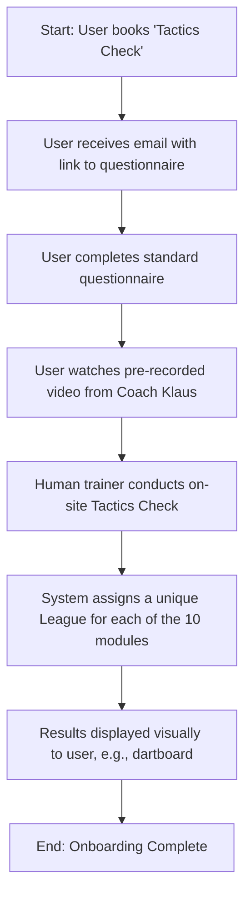
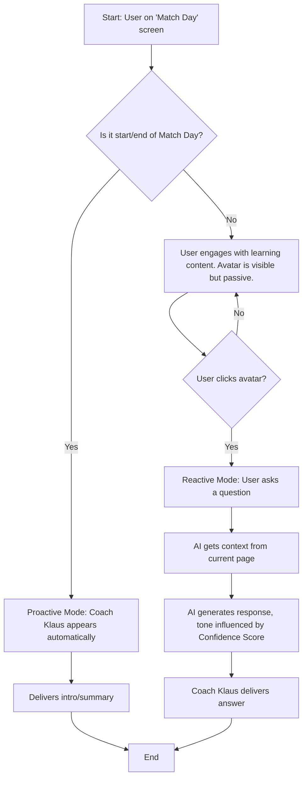
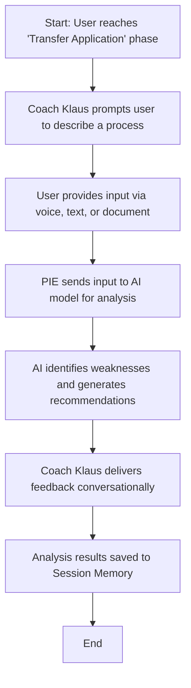
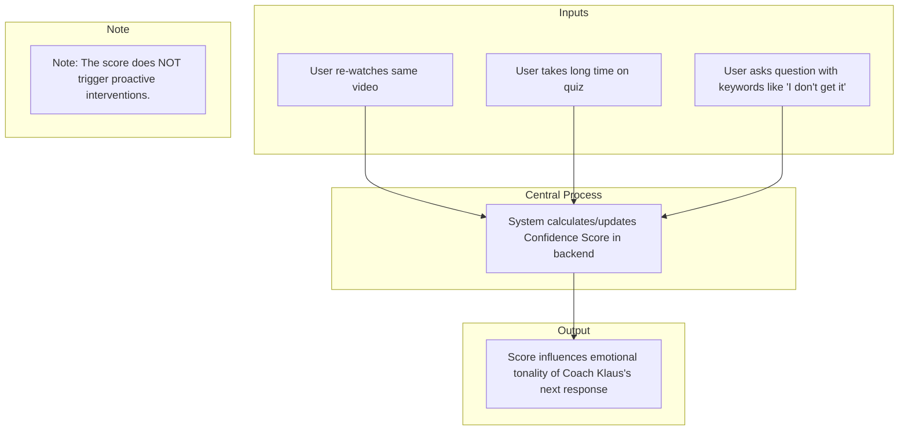

# Finalized User Journey with Meeting Clarifications

Author: Nouman Javaid, Bilal Khalid, Muhammad Irtaza, Muhammad Usman Khan
Creation Date: July 2, 2025
Version: Final

---

<aside>
💡

<aside>
✅

This document outlines the user journey, updated with the specific decisions and clarifications from our recent project meeting. All points are referenced against the  and our discussion.

</aside>

To best compare each visual flow against its explanation, we recommend viewing in full screen.

</aside>

<aside>
💡

What we have understood based off our meeting on July 1, 2025 

[Flowchart Diagrams.mp4](Finalized%20User%20Journey%20with%20Meeting%20Clarifications%202249ae7944c680a5aaffc59f501ccb40/Flowchart_Diagrams.mp4)

</aside>

[Discovery_Detailed_Project_Briefing (1).pdf](Finalized%20User%20Journey%20with%20Meeting%20Clarifications%202249ae7944c680a5aaffc59f501ccb40/Discovery_Detailed_Project_Briefing_(1).pdf)

### **Phase 1: Onboarding & Initial Assessment**

This is the foundational phase where the user is introduced to the platform and the system gathers the initial data required for personalization. The entire process is detailed in **Section 8.1: "Getting started & onboarding - experience module and tactics check" (Page 30)**.

- **Step 1: Booking & Start**
The law firm books the "tactics check" via the platform's online store. Immediately after booking, they are directed to a start page with a welcome video and a calendar tool (e.g., [Cal.com](http://cal.com/)) to schedule their on-site appointment.
    - **Question:** Do we have an intervention here at this point? What would be our role?
    - **Answer:** At this stage, there is **no AI or human intervention**. The process is fully automated. The system provides the welcome video and calendar tool.
- **Step 2: Preparation Phase**
After booking, the firm receives an automated email confirming the appointment. This email includes a link to a preparatory questionnaire. This is described as the first "training session" and provides the system with its first individual data points.
    - **Question:** Do we have an intervention here at this point? What would be our role?
    - **Answer:** There is **no AI intervention**. The questionnaire is **standardized** for every customer, asking basic questions like company size and number of employees. Our role is simply to provide this standard form.
- **Step 3: First Contact with Coach Klaus**
Upon completing the preparation questionnaire, the user receives their first communication from Coach Klaus in the form of a **pre-recorded, non-interactive short video**. This serves as the initial emotional connection to the AI character.
- **Step 4: The "Tactics Check"**
This is a physical, on-site meeting with a human trainer from the Zukunftsschmiede team. The trainer uses a dedicated interface to guide the law firm through a structured survey consisting of 5-10 questions per module. All data is captured and stored in the system's "session memory" to be used by the Adaptive Decision Engine.
- **Step 5: Evaluation & League Classification**
At the end of the tactics check, the results are presented visually. The briefing specifies an "animated dartboard" to represent performance in each module. Based on these results, the firm is assigned to one of three leagues: Starting league, Taktgeberliga, or Playmaker league. Coach Klaus moderates this evaluation and provides motivating closing words.

### **Phase 2: The Core Learning Loop (The "Match Day")**

This is the central, recurring part of the user experience, where the actual learning and interaction take place. This is detailed in **Section 8.2: "Procedure of a match day" (Page 32)**.

- **Learning as a Team**
The platform is designed for the law firm to go through each "match day" as a team, not as individuals. The recommended rhythm is two match days per week, each lasting approximately 45-60 minutes.
- **The 5+1 Phase Structure**
Each match day follows a consistent didactic structure:
    1. **Attunement:** An intro by Coach Klaus to set the context.
    2. **Knowledge Impulse:** The core content, delivered via video or animated explanations.
    3. **Processing:** Interactive elements like quizzes and reflection questions.
    4. **Transfer Application:** Applying the knowledge, for example by submitting a real-world process to the Process Intelligence Engine (PIE).
    5. **Conclusion & Motivation:** A summary, feedback on league progress, and a mini-challenge.
    **+1. Resilience & Regeneration:** Flexible impulses for emotional strengthening.
- **The Role of Coach Klaus during a Match Day**
Coach Klaus acts as an emotional and adaptive companion, not just a knowledge provider. He welcomes the team, provides motivation, reflects on past progress, and is available for questions via voice input.

### **Phase 3: Continuous Engagement & Development**

This phase describes how the platform maintains engagement and supports the user's development over the long term.

- **Ongoing Support from Coach Klaus**
Coach Klaus is always present but not intrusive. He proactively provides reminders for upcoming match days, offers encouragement for strong performance, and gives feedback on progress. His behavior is controlled by the **Adaptive Decision Engine (ADE)** and the **Confidence Score**, making his interactions feel context-aware and personalized.
- **Community & Social Interaction**
The platform includes a community area with thematic discussion rooms and "highlight walls." Regular, moderated community calls are also held. This fosters peer learning and allows users to exchange ideas and solutions.
- **Reflection and League Development**
At the end of each match day, progress is visualized through scores, progress bars, or other symbolic animations. While a full league change only happens after a new tactics check, the user's current standing and progress toward the next level are made visible to maintain motivation.

### **Phase 4: Applying Knowledge with the Process Intelligence Engine (PIE)**

This is a key feature that bridges the gap between theoretical knowledge and real-world application.

- **Analyzing Real-World Processes**
As part of a match day's "Transfer Application" phase, users can describe one of their firm's actual processes via voice, text, or by uploading a document.
- **Receiving Actionable Feedback**
The PIE analyzes the submitted process. It identifies weaknesses (like media discontinuities or lack of automation) and provides concrete, actionable recommendations that are linked back to the platform's learning modules. Coach Klaus moderates this feedback, turning it into a coaching conversation.

---

### **Finalized PIE Example (Based on Meeting)**

- **When is the PIE used?**
    1. **Included:** Once per relevant "Match Day" during the "Transfer Application" phase. This is part of the standard package.
    2. **Add-on:** Users can purchase extra, standalone PIE sessions from the shop for on-demand process analysis.
- **How is it used? (A practical example)**
    1. **The Prompt:** Coach Klaus appears automatically and says: *"Okay team, we've just covered the key elements of a smooth client onboarding. To make this real, tell me exactly how you onboard a new client right now."*
    2. **The User's Input:** A team member speaks or types: *"Well, first the client calls and we write their details down on a notepad. Then, our assistant types those notes into a Word document. We print that document for the client's physical file..."*
    3. **The Analysis:** The PIE sends this text to the AI model. The AI identifies weaknesses based on the module's content.
        - **Identified Weakness 1:** "Media Discontinuity" (Notepad -> Word -> Print).
        - **Identified Weakness 2:** "Lack of Automation" / "Redundant Data Entry".
    4. **The Feedback:** Coach Klaus delivers the feedback conversationally: *"Thanks for sharing. I noticed you're re-typing the information. Remember how we talked about reducing manual steps? A simple digital form could solve this. This is covered in more detail in Module 4 if you'd like a refresher."*
    5. **Scoring:** This interaction is **not scored**. It is a qualitative, practical exercise. The results are saved to the Session Memory for future context.