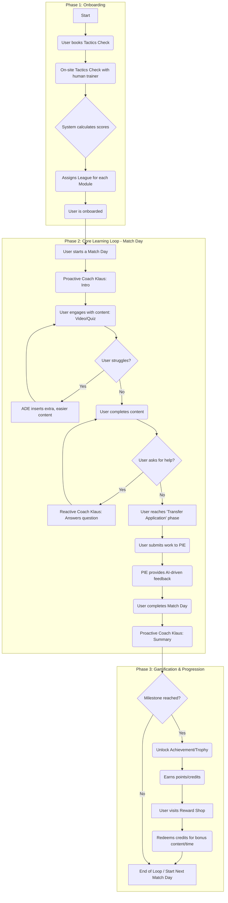

# User Journey for Learning module Finalized

Author: Bilal Khalid, Nouman Javaid, Menahil Baig
Creation Date: July 6, 2025
Type: Discovery Conclusion
Version: Final

This document outlines the finalized design philosophy, learning architecture, and gamification strategy for "The Forge" platform, based on our detailed discussion Here [**LMS Design and Gamification Strategy for Learning Platform**](../MOM%E2%80%99s%202229ae7944c68035829cfa2113385f9a/LMS%20Design%20and%20Gamification%20Strategy%20for%20Learning%20%202269ae7944c6801196e3f2968b0a60fb.md) 

**Core 'Match Day' Interaction Loop (UI Concept - Phase 1):**

- **Entry:** User (representing the team) starts a 'match day'. The UI should evoke a sense of being in a specific environment (e.g., a 'cabin', 'gym', 'stadium area'). For MVP UI concepts, this will be a 2D representation (e.g., static background image with UI elements overlaid).
- **Coach Klaus Introduction (Fixed):** Coach Klaus appears/activates automatically to set the context for the match day, possibly referencing the previous day. (This would be a pre-defined script/animation concept).
- **Content Consumption:** User views content (e.g., video, animated explanation).
- **Interactive Elements:** User engages with quizzes or reflection questions.
- **On-Demand Coach Klaus:**
    - Coach Klaus avatar is persistently visible (e.g., like the POC video, perhaps in a corner or integrated into the 'room' scene).
    - Interaction (voice or text) is initiated by the user clicking/activating Klaus.
    - Usage will be limited (e.g., X questions per match day, or a credits system).
    - Klaus has context of the current content/quiz.
    - Klaus's responses will vary in empathy based on a 'confidence score' (calculated from user's quiz performance, repeated questions, keywords like "I don't get it").

<aside>

## 1. Core Design Philosophy: The Immersive Sports World

The platform's user interface will not be a traditional LMS. Instead, it will be an **immersive, pre-rendered world** designed to make the user feel like they are inside a professional sports ecosystem.

- **Visual Environment:** The UI will be built around a series of high-quality, pre-rendered backgrounds depicting different locations within a sports stadium (e.g., the locker room, the gym, the press area, the main pitch). This creates the *illusion* of a 3D world without the overhead of a full game engine.
- **Guided Navigation:** Users will not have free-roam capabilities. Navigation between sections will be handled through **pre-defined, animated camera transitions**. For example, upon completing a task in the "cabin," the camera will animate a swift movement through a hallway to the "gym" for the next task.
- **Contextual Integration:** All learning content (videos, quizzes, interactive tools) will be seamlessly integrated into these environments. A video lesson might play on a large screen within the virtual locker room, and an interactive quiz might appear on a tablet on a table.
- **League-Based Worlds:** The visual theme of the world will change based on the user's league, creating a clear sense of progression:
    - **Beginner League:** A simple, local training pitch environment.
    - **Intermediate League:** A more professional, mid-sized stadium.
    - **Expert League:** A stunning, top-tier dome stadium with luxury facilities.

> Design Requirement: The client's team will provide approximately 15 unique room designs, each with three variations corresponding to the three leagues (Beginner, Intermediate, Expert), for a total of ~45 **pre-rendered backgrounds.**
> 
</aside>

## 2. Gamification & Motivation Strategy

Gamification will be deeply integrated into the narrative and user journey, focusing on progression and achievement rather than just points.

- **League System:** The core progression mechanic. Users are assigned to one of three leagues **per module**, based on their "Taktikcheck" score. Their goal is to advance to higher leagues in all modules.
- **Achievements & Trophies:** Users will unlock badges and trophies for key milestones (e.g., completing a module, achieving a high score, advancing to a new league). These will be displayed on a "Highlight Wall" in the community section.
- **Coach's Notebook / Storyboard:** A feature where key insights or "main topics" from each completed Match Day are automatically added as a one-sentence summary to a personal digital notebook. This allows users to track their learning journey over time.
- **Credit & Reward System:**
    - Users will have a limited number of free interactions (questions) with Coach Klaus per Match Day.
    - They can earn points/credits by completing quizzes and tasks.
    - These credits can be redeemed in a "shop" for extra one-on-one consultation time with Coach Klaus or for access to bonus content.

## 3. The "Match Day" Learning Architecture

Each learning session is a "Match Day," a flexible but structured experience. While the exact components can vary, they follow a general flow and include diverse interaction types.

- **Sequential Progression:** Users **must** complete each step of a Match Day in order. They cannot skip videos or quizzes to jump ahead. If a user attempts to skip, a pre-defined prompt from Coach Klaus will appear to encourage them to complete the step.
- **No Time Limits (for MVP):** Quizzes and learning sections will not have strict time limits. The user's session will be saved, allowing them to pause and resume from where they left off.
- **Diverse Content & Interaction Types:**
    - **Pre-recorded Videos:** High-quality videos integrated into the virtual environment.
    - **Standard Quizzes:** Multiple-choice questions to test knowledge.
    - **Branching Scenarios:** The students are going to proceed based on the decision trees where their choices lead to different modules **(These are pre-defined)**
    - **Flowchart Builder:** An interactive tool where users can build their own process diagrams using drag-and-drop shapes and lines. The final flowchart can be downloaded as a PDF/PNG.
    - **PIE Submission:** The "Transfer Application" phase where users submit their own work for AI analysis.

## 4. AI Interaction & Adaptive Learning

The AI is not just a chatbot; it's a multi-faceted system designed to guide, support, and adapt to the user.

- **Coach Klaus Interaction Model:**
    - **Proactive (Mandatory):** Coach Klaus appears automatically at the start and end of each Match Day to provide context and summaries. These are pre-scripted events.
    - **Reactive (User-Initiated):** During a lesson, the Coach Klaus avatar is always visible but passive. The user must click on the avatar to ask a question. The AI will have the context of the current lesson to provide a relevant answer.
- **Adaptive Decision Engine (ADE):**
    - The ADE works in the background. If it detects a user is struggling (based on a low Confidence Score from repeated errors or help requests), it can **dynamically insert additional, pre-defined content** into their learning path.
    - **Example:** If a user fails a quiz twice, the ADE might insert an extra "baby version" of a video that explains the concept in simpler terms before allowing them to retake the quiz.
- **Live Sessions & Note-Taking:**
    - **Some Match Days will be live coaching sessions with a human trainer, requiring integration with Google Meet/Teams, however, for v1 advised technique to achieve this is that the meeting is recorded manually and then uploaded to our system for analysis.**

## 5. Pre-defined Content & Logic Requirements

This section clarifies all the elements that must be created and configured by the content team (Sasha's team) to power the platform.

> Note: The following items are required from the client's content team before development on a specific module can begin.
> 
- **Visuals & Navigation:**
    - **Backgrounds:** The high-quality, pre-rendered images for each room in each of the three league-based worlds.
- **Gamification Rules:**
    - **Achievement Criteria:** The specific rules for unlocking each badge and trophy.
    - **Reward Shop Content:** The list of redeemable items, their costs in credits, and the bonus content they unlock.
    - **Coach's Notebook Logic:** The rules that determine which sentence from a lesson is a "key insight" to be saved.
- **Match Day Content (Per Match Day):**
    - **Video & Text Content:** All educational videos and written materials.
    - **Quiz Content:** All questions, correct answers, and incorrect answer options.
    - **Branching Scenario Logic:** The complete decision tree for each scenario.
    - **Coach Klaus Scripts:** The exact text for the mandatory, proactive intro and outro messages.
    - **Skip-Prevention Prompts:** The variations of text Coach Klaus will use when a user tries to skip a step.
- **Adaptive Learning Rules (ADE):**
    - **Struggle-Detection Rules:** The specific triggers for the ADE (e.g., "If Confidence Score drops below 40," or "If user fails the same quiz 2 times").
    - **Remedial Content:** The library of "baby version" videos or easier quizzes that the ADE can insert into a user's learning path.

## 🗺️ 6. End-to-End User Journey Flowchart

This flowchart visualizes the complete user journey, from initial onboarding through a typical learning loop, including interactions with the AI and gamification systems.

